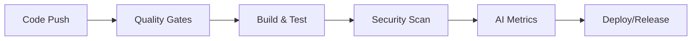

# CFHub iOS - GitHub Project Documentation

## Overview

CFHub iOS follows **Claude-first development practices** with comprehensive GitHub integration for project management, CI/CD, and community collaboration.

## 🚀 GitHub Project Structure

### Repository Organization
```
cfhub-ios/
├── .github/                     # GitHub-specific configuration
│   ├── workflows/              # GitHub Actions workflows
│   │   ├── ci.yml             # Continuous Integration
│   │   └── release.yml        # Automated releases
│   ├── ISSUE_TEMPLATE/        # Issue templates
│   │   ├── bug_report.yml     # Bug reports
│   │   ├── feature_request.yml # Feature requests
│   │   └── new_integration.yml # Integration requests
│   ├── PULL_REQUEST_TEMPLATE.md # PR template
│   ├── SECURITY.md            # Security policy
│   └── dependabot.yml         # Dependency management
├── docs/                      # Project documentation
├── scripts/                   # Development scripts
├── Sources/                   # Swift source code
└── Tests/                     # Test suites
```

## 🤖 AI-First Development Workflow

### Automated Quality Gates
Our GitHub Actions enforce Claude-first standards:

1. **AI Attribution Validation**: Ensures all code includes proper AI attribution
2. **Architecture Compliance**: Validates integration-first patterns
3. **Security Scanning**: Checks for hardcoded secrets and vulnerabilities
4. **Code Quality**: SwiftLint, build validation, and test coverage
5. **Release Automation**: AI-attributed releases with comprehensive notes

### CI/CD Pipeline


## 📋 Project Management

### GitHub Issues
We use structured issue templates for:

- **🐛 Bug Reports**: Comprehensive bug reporting with environment details
- **✨ Feature Requests**: Feature proposals aligned with our architecture
- **🔌 Integration Requests**: New service integration requests
- **📝 Documentation**: Documentation improvements and updates

### Labels System
```
Priority:
- priority:critical    # Security, broken builds
- priority:high       # Important features, major bugs  
- priority:medium     # Standard features, minor bugs
- priority:low        # Nice-to-have features

Type:
- bug                 # Something isn't working
- enhancement         # New feature or improvement
- integration         # New service integration
- documentation       # Documentation improvements
- ai-assisted         # AI-generated content

Status:
- needs-triage        # Awaiting initial review
- ready-for-review    # Ready for code review
- needs-changes       # Changes requested
- approved            # Approved for merge

Area:
- core                # CFHubCore changes
- client              # CFHubClient changes
- app                 # CFHubApp changes
- cloudflare          # Cloudflare integration
- github              # GitHub integration
```

### Milestones
- **v1.0 Core Platform**: Basic infrastructure management
- **v1.1 Enhanced Integrations**: Extended service support
- **v1.2 Advanced Features**: Monitoring, analytics, automation
- **v2.0 Enterprise**: Team features, advanced security

## 🔄 Release Management

### Semantic Versioning
- **Major (X.0.0)**: Breaking changes, new architecture
- **Minor (X.Y.0)**: New features, integrations, enhancements
- **Patch (X.Y.Z)**: Bug fixes, security patches

### Release Process
1. **Tag Creation**: `git tag v1.0.0`
2. **Automated Validation**: Full quality gate validation
3. **Release Generation**: AI-attributed release notes
4. **Artifact Creation**: Build artifacts and documentation
5. **Notification**: Community notification and metrics

### Release Notes Template
```markdown
## CFHub iOS v1.0.0

### 🚀 What's New
- Integration-first architecture implementation
- Cloudflare and GitHub integrations
- Swift 6 concurrency compliance

### 🤖 AI Development Metrics
- AI-Assisted Commits: 87% (45/52 commits)
- Code Attribution: Following Claude-first practices
- Quality Gates: All automated checks passed

### 📱 Installation
Add to your Swift Package Manager dependencies:
```swift
.package(url: "https://github.com/username/cfhub-ios.git", from: "1.0.0")
```

### 🔒 Security
- Proxy authentication model
- No client-side credentials
- Swift 6 memory safety
```

## 🔐 Security & Compliance

### Security Policy
- **Vulnerability Reporting**: Responsible disclosure process
- **Security Model**: Client proxy authentication architecture
- **Automated Scanning**: Dependabot and security workflows
- **Code Review**: Security-focused review process

### Compliance Tracking
- **AI Attribution**: 100% coverage required for releases
- **Test Coverage**: 95% minimum coverage
- **Documentation**: Up-to-date with all features
- **Security**: No hardcoded credentials or secrets

## 👥 Community & Collaboration

### Contributing Process
1. **Read Guidelines**: Review `CONTRIBUTING.md`
2. **Choose Issue**: Select from labeled issues
3. **Create Branch**: Follow naming conventions
4. **Implement**: Follow AI attribution requirements
5. **Test**: Pass all quality gates
6. **Submit PR**: Use structured PR template
7. **Review**: Address feedback and iterate

### Code Review Standards
- **Architecture Alignment**: Integration-first principles
- **AI Attribution**: Proper attribution included
- **Security**: No credentials, proper validation
- **Testing**: Comprehensive test coverage
- **Documentation**: Updated as needed

### Recognition
- **Contributors**: Acknowledged in releases
- **AI Partnership**: Both human and AI contributions recognized
- **Quality Standards**: Maintaining high development standards

## 📊 Project Metrics

### Development Metrics
- **AI Contribution**: Percentage of AI-generated code
- **Quality Gates**: Pass rate and compliance
- **Test Coverage**: Overall and per-module coverage
- **Release Cadence**: Regular feature and security releases

### Community Metrics
- **Issue Response Time**: Target 24 hours
- **PR Review Time**: Target 48 hours
- **Release Frequency**: Monthly minor releases
- **Community Growth**: Contributors and adopters

## 🛠️ Development Tools

### GitHub Integrations
- **Actions**: Automated CI/CD pipeline
- **Dependabot**: Automated dependency updates
- **Security**: Vulnerability scanning and alerts
- **Projects**: Milestone and epic tracking

### Local Development
```bash
# Setup development environment
./scripts/setup-ai-workflow.sh

# Quality gates
./scripts/validate-standards.sh

# Git helpers
git ai-commit              # AI-attributed commits
git check-attribution      # Find missing attribution
git validate              # Run quality checks
```

## 📚 Documentation Structure

### Core Documentation
- **README.md**: Project overview and quick start
- **CONTRIBUTING.md**: Contribution guidelines
- **CLAUDE.md**: AI development guidelines
- **SECURITY.md**: Security policy and reporting

### Technical Documentation
- **docs/architecture.md**: Technical architecture
- **docs/getting-started.md**: Developer setup guide
- **docs/security.md**: Security model details
- **docs/github-project.md**: This document

### API Documentation
- **Swift DocC**: In-code documentation
- **Integration Guides**: Service-specific guides
- **Examples**: Sample implementations

## 🎯 Future Enhancements

### GitHub Features
- **Advanced Analytics**: Development velocity metrics
- **Community Templates**: Issue and PR enhancements
- **Integration Workflows**: Cross-repository automation
- **Security Enhancements**: Advanced scanning and policies

### Development Experience
- **VS Code Integration**: Enhanced IDE support
- **CLI Tools**: Development workflow automation
- **Testing Infrastructure**: Enhanced testing capabilities
- **Documentation Generation**: Automated doc updates

---

**🤖 Generated with [Claude Code](https://claude.ai/code)**

**Co-Authored-By: Claude <noreply@anthropic.com>**

This documentation serves as the complete guide for GitHub project management within our Claude-first development model.